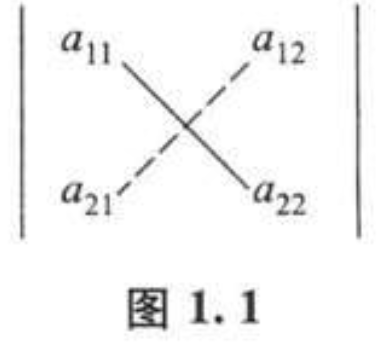
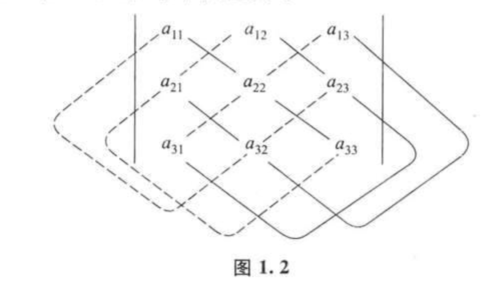

> [!abstract] 章节概括
> 
> 本章主要介绍行列式的定义、性质及其基本计算方法。从低阶（二阶、三阶）行列式的对角线法则出发，通过引入全排列和逆序的概念，推导出 $n$ 阶行列式的通用定义。随后讨论行列式的六大核心性质，并介绍行列式按行（列）展开的定理。

## §1 二阶与三阶行列式

### 1. 二阶行列式

二阶行列式由 4 个元素 $a_{ij}$ 排成 2 行 2 列，定义为：

$$\begin{vmatrix} a_{11} & a_{12} \\ a_{21} & a_{22} \end{vmatrix} = a_{11}a_{22} - a_{12}a_{21}$$

> [!summary] 总结
> 
> 二阶行列式的结果是主对角线元素的乘积减去副对角线元素的乘积。

实连线是主对角线，虚连线是副对角线

### 习题原题

求解二元线性方程组：

$$\begin{cases} 3x_1 - 2x_2 = 12 \\ 2x_1 + x_2 = 1 \end{cases}$$
### 克拉默法则求解步骤

#### 1. 计算系数行列式 $D$

$D$ 是由未知数系数组成的行列式：

$$D = \begin{vmatrix} 3 & -2 \\ 2 & 1 \end{vmatrix} = (3 \times 1) - (-2 \times 2) = 3 + 4 = 7$$

由于 $D \neq 0$，该方程组有唯一解。

#### 2. 计算 $D_1$

将 $D$ 的第一列（$x_1$ 的系数）替换为等号右侧的常数项 $(12, 1)^T$：

$$D_1 = \begin{vmatrix} 12 & -2 \\ 1 & 1 \end{vmatrix} = (12 \times 1) - (-2 \times 1) = 12 + 2 = 14$$

#### 3. 计算 $D_2$

将 $D$ 的第二列（$x_2$ 的系数）替换为等号右侧的常数项 $(12, 1)^T$：

$$D_2 = \begin{vmatrix} 3 & 12 \\ 2 & 1 \end{vmatrix} = (3 \times 1) - (12 \times 2) = 3 - 24 = -21$$

#### 4. 计算未知数值

根据克拉默法则公式：

$$x_1 = \frac{D_1}{D} = \frac{14}{7} = 2$$

$$x_2 = \frac{D_2}{D} = \frac{-21}{7} = -3$$

**结论：** 方程组的解为 $x_1 = 2, x_2 = -3$。

---

### 笔记总结

> [!cite] 克拉默法则 (Cramer's Rule)
> 
> **适用前提**：
> 
> - 方程个数与未知数个数相等。
>     
> - 系数行列式 $D \neq 0$。
>     
> 
> **算法核心**：
> 
> 1. 构建系数矩阵的行列式 $D$。
>     
> 2. 构建 $D_j$：将 $D$ 的第 $j$ 列替换为方程右侧的常数向量。
>     
> 3. 解的公式：$x_j = \frac{D_j}{D}$。
>     
> 
> [图片占位符：克拉默法则行列式替换示意图]

> [!warning] 逻辑注意点
> 
> - 若 $D = 0$ 且存在 $D_j \neq 0$，则方程组无解。
>     
> - 若 $D = 0$ 且所有 $D_j = 0$，则方程组有无穷多解或无解（需进一步讨论）。
>     
> - 克拉默法则在处理高阶方程组（如 $n > 3$）时，计算量远大于高斯消元法。
>     

现在此举例子，后续会跟详细学习克拉默法则

### 2. 三阶行列式

三阶行列式包含 $3^2=9$ 个元素，其计算遵循“沙路斯法则”（对角线法则）：

$$\begin{vmatrix} a_{11} & a_{12} & a_{13} \\ a_{21} & a_{22} & a_{23} \\ a_{31} & a_{32} & a_{33} \end{vmatrix} = a_{11}a_{22}a_{33} + a_{12}a_{23}a_{31} + a_{13}a_{21}a_{32} - a_{11}a_{23}a_{32} - a_{12}a_{21}a_{33} - a_{13}a_{22}a_{31}$$

> [!note] 书中示例简述
> 
> **例 1**：通过行列式求解二元线性方程组。若系数行列式 $D \neq 0$，方程组有唯一解，其分子为用常数项替换系数矩阵对应列后得到的行列式。

## §2 全排列和对换

### 1. 逆序与逆序数

- **全排列**：由 $n$ 个不同元素排成的一列。
    
- **逆序**：在排列中，若较大的数排在较小的数前面，则称这两个数构成一个逆序。
    
- **逆序数**：排列中逆序的总数，记作 $N(p_1 p_2 \dots p_n)$ 或 $\tau(p_1 p_2 \dots p_n)$。
    
### 2. 奇、偶排列与对换

- **奇/偶排列**：逆序数为奇数/偶数的排列。
    
- **对换**：交换排列中两个元素的位置，其余元素不动。
    
- **性质**：一个对换会改变排列的奇偶性。
    
#### 逆序数计算结果汇总

以下是针对 $n=3$ 时全排列的逆序数及符号计算：

|**排列 (j1​j2​j3​)**|**逆序对情况**|**逆序数 (t)**|**符号 (−1)t**|
|---|---|---|---|
|**(123)**|无|$0$|$+1$|
|**(132)**|(3, 2)|$1$|$-1$|
|**(231)**|(2, 1), (3, 1)|$2$|$+1$|
|**(213)**|(2, 1)|$1$|$-1$|
|**(312)**|(3, 1), (3, 2)|$2$|$+1$|
|**(321)**|(3, 2), (3, 1), (2, 1)|$3$|$-1$|

> [!tip] 逻辑推导过程
> 
> 1. **确定标准次序**：默认为自然增长顺序 $1, 2, 3 \dots$。
>     
> 2. **逐位扫描**：从左向右观察每个数字，计算其右侧比它小的数字个数。
>     
> 3. **累加求和**：所有位置计算出的个数相加即为 $t$。
>     
> 4. **符号判定**：$t$ 为偶数则为正（偶排列），$t$ 为奇数则为负（奇排列）。
>     

## §3 $n$ 阶行列式的定义

> [!important] 按行定义
> 
> $n$ 阶行列式 $D = \det(a_{ij})$ 是 $n!$ 项之和：
> 
> $$D = \sum_{p_1 p_2 \dots p_n} (-1)^{N(p_1 p_2 \dots p_n)} a_{1p_1} a_{2p_2} \dots a_{np_n}$$
> 
> 其中 $\sum$ 表示对所有 $n$ 级排列 $p_1 p_2 \dots p_n$ 求和。

> [!tip] 逻辑推导
> 
> 1. 每项由来自不同行、不同列的 $n$ 个元素相乘。
>     
> 2. 符号由列下标排列的逆序数的奇偶性决定。
>     

## §4 行列式的性质

> [!info] 核心性质列表
> 
> 1. **性质 1**：行列式与其转置行列式相等（$D = D^T$）。说明行与列在行列式计算中地位对称。
>     
> 2. **性质 2**：对换行列式的两行（列），行列式变号。
>     
>     - **推论**：若行列式有两行（列）完全相同，则行列式为 0。
>         
> 3. **性质 3**：行列式的某一行（列）的所有元素都乘以同一个数 $k$，等于用数 $k$ 乘以此行列式。
>     
>     - **推论 1**：行列式某一行（列）的公因子可以提到行列式符号外面。
>     - **推论 2**：行列式若有两行（列）元素成比例，则其值为 0。
>     
> 4. **性质 4**：若行列式的某一行（列）元素都是两个数之和，则可以拆分为两个行列式之和。
> 	
>     - **推论** ：一次只能拆一行（列），其他必须保持不变
>     
> 5. **性质 5**：把行列式的某一行（列）的 $k$ 倍加到另一行（列）上，行列式的值不变。

### 知识点：行列式“打洞法”（分块展开）

> [!abstract] 核心逻辑
> 
> 利用初等变换（性质6：将一行的 $k$ 倍加到另一行），在行列式的左下角或右上角制造出一个全为 0 的子矩阵。

## §5 行列式按行（列）展开

### 1. 余子式与代数余子式

- **余子式 $M_{ij}$**：在 $n$ 阶行列式中，划去元素 $a_{ij}$ 所在的第 $i$ 行与第 $j$ 列后剩余的 $n-1$ 阶行列式。
    
- **代数余子式 $A_{ij}$**：$A_{ij} = (-1)^{i+j} M_{ij}$。
    

### 2. 展开定理

> [!theory] 行列式按行（列）展开定理
> 
> 行列式等于它的任一行（或列）的各元素与其对应的代数余子式乘积之和。
> 
> $$D = a_{i1}A_{i1} + a_{i2}A_{i2} + \dots + a_{in}A_{in}$$

> [!warning] 重要引理
> 
> 行列式的某一行元素与另一行对应元素的代数余子式乘积之和等于 0。即：
> 
> $\sum a_{ij} A_{kj} = 0$ （当 $i \neq k$ 时）。

我们来看一道例题

### 题目：计算四阶行列式

$$D = \begin{vmatrix} 3 & 1 & -1 & 2 \\ -5 & 1 & 3 & -4 \\ 2 & 0 & 1 & -1 \\ 1 & -5 & 3 & -3 \end{vmatrix}$$

---

### 第一阶段：逻辑观察与目标设定

> [!INFO] 观察
> 
> 1. 第三行 $r_3 = [2, 0, 1, -1]$ 已经有一个元素为 0。
>     
> 2. 第二列 $c_2 = [1, 1, 0, -5]^T$ 含有较小的整数 1，适合作为“消元中心”。
>     
> 
> **策略**：我们选择**第二列**作为展开目标，利用 $a_{12}=1$ 将该列的其他非零元素化为 0。

---

### 第二阶段：初等变换（打洞）

我们需要将第二列除 $a_{12}$ 以外的元素处理为 0。

1. **消除 $a_{22}$**：执行 $r_2 - r_1$
    
    $$a_{22} = 1 - 1 = 0$$
    
    $$a_{21} = -5 - 3 = -8, \quad a_{23} = 3 - (-1) = 4, \quad a_{24} = -4 - 2 = -6$$
    
2. **消除 $a_{42}$**：执行 $r_4 + 5r_1$
    
    $$a_{42} = -5 + 5(1) = 0$$
    
    $$a_{41} = 1 + 5(3) = 16, \quad a_{43} = 3 + 5(-1) = -2, \quad a_{44} = -3 + 5(2) = 7$$
    

> [!SUCCESS] 变换后的行列式
> 
> $$D = \begin{vmatrix} 3 & 1 & -1 & 2 \\ -8 & 0 & 4 & -6 \\ 2 & 0 & 1 & -1 \\ 16 & 0 & -2 & 7 \end{vmatrix}$$
> 
> 

---

### 第三阶段：利用展开定理降阶

现在第二列只有一个非零元素 $a_{12} = 1$。按第二列展开：

$$D = a_{12} A_{12} = 1 \cdot (-1)^{1+2} M_{12}$$

1. **确定符号**：$(-1)^{1+2} = -1$。
    
2. **提取余子式 $M_{12}$**（划去第一行和第二列）：
    
    $$D = -1 \cdot \begin{vmatrix} -8 & 4 & -6 \\ 2 & 1 & -1 \\ 16 & -2 & 7 \end{vmatrix}$$
    

---

### 第四阶段：三阶行列式计算

针对得到的 $M_{12}$，继续使用打洞法或直接按行/列展开。

1. **继续打洞**：观察第二行 $r_2 = [2, 1, -1]$。执行 $c_1 - 2c_2$ 和 $c_3 + c_2$。
    
    $$M_{12} = \begin{vmatrix} -8-2(4) & 4 & -6+4 \\ 2-2(1) & 1 & -1+1 \\ 16-2(-2) & -2 & 7+(-2) \end{vmatrix} = \begin{vmatrix} -16 & 4 & -2 \\ 0 & 1 & 0 \\ 20 & -2 & 5 \end{vmatrix}$$
    
2. **按第二行展开**：
    
    $$M_{12} = 1 \cdot (-1)^{2+2} \cdot \begin{vmatrix} -16 & -2 \\ 20 & 5 \end{vmatrix}$$
    
3. **计算二阶行列式**：
    
    $$M_{12} = (-16 \cdot 5) - (-2 \cdot 20) = -80 + 40 = -40$$
    

---

### 最终结果

> [!IMPORTANT] 结论
> 
> 回代到第三阶段的公式中：
> 
> $$D = -1 \cdot M_{12} = -1 \cdot (-40) = 40$$

---

> [!SUMMARY] 助教逻辑总结
> 
> 1. **选取基准**：找含有 1 或 -1 的行/列。
>     
> 2. **执行消元**：利用性质 6 制造尽可能的零。
>     
> 3. **降阶展开**：注意代数余子式的符号 $(-1)^{i+j}$。
>     
> 4. **递归处理**：直到降至二阶。
>     

